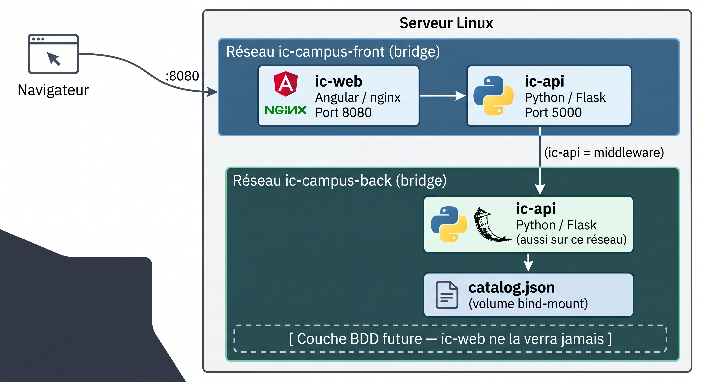

<h1>IC-Campus, projet de création d’une infrastructure</h1>

<h2>Présentation de l'infrastructure</h2>

Nous aurons le frontend et le backend chacun dans un réseau différent. Cette option apporte de la sécurité, en réduisant la surface possible d’attaque. La charge de travail est aussi répartie entre les deux serveurs. De plus, la maintenabilité est accrue et la structure réalisée permet de réduire les risques de bugs après la modification d’un module.

<h2>Création du DockerFile Api</h2>

Voici le Dockerfile que j’ai rédigé en suivant les instructions données. Nous avons une utilisation de l’image python:3.12-alpine. J’attribue ensuite les valeurs aux labels désignés.
Nous pouvons voir que j’ajoute deux paquets : libcrypto3 et curl. L’explication de la présence de libcrypto3 viendra plus tard, curl, lui, nous permet de tester la connexion à la fonction health plus bas. 
Ensuite je vais copier le requirements.txt qui nous permettra d’installer les dépendances utiles lors du pip install juste en dessous.
Je rapatrie ensuite le code source et les données qui seront utilisées.
Viens la création de l’utilisateur apposer, j’accorde les droits aux dossiers indispensables et je le connecte.
Le volume /data est créé. Et je met en place le HEALTHCHECK qui permettra de vérifier la disponibilité du serveur et renverra un statut healthy lors de son bon fonctionnement.
Ensuite la commande pour lancer gunicorn, qui écoutera sur toutes les adresses du réseau à condition d’appeler le port 5000 et laissera la possibilité de deux connexions simultanées.

   
